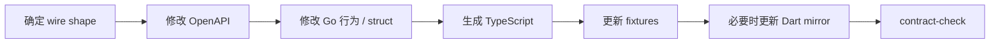

# API 契约

论坛 JSON API 使用 OpenAPI 3.1 管理。

这套契约把后端行为、Web 类型、fixtures 和路由覆盖绑在同一个 PR 中，避免接口已经变化、客户端类型仍停在旧版本。

## 契约放在哪里

```text
packages/api-contract/
  openapi.yaml
  paths/
  fixtures/
  route-coverage.json
  coverage-matrix.md
```

`openapi.yaml` 是入口。具体 path 按业务域拆分，避免所有人同时修改一个巨大的 YAML 文件。

## 一次 API 变更怎么走

例如给一个受管接口增加响应字段：



这样前端不会等到运行时报 `undefined` 才发现后端已经换了结构。

## 检查契约

```bash
make contract-check
```

它会检查：

- OpenAPI lint / bundle。
- 路由覆盖。
- TypeScript 生成。
- 已提交生成产物是否有漂移。
- coverage matrix 是否一致。

新增 `/api` JSON route 时，如果没有契约或明确 exclusion，CI 会失败。

## TypeScript

Web 使用的生成类型位于：

```text
apps/gooseforum/resource/packages/client/src/gen/
```

不要手工修改生成文件。字段有问题时回到 OpenAPI 源修。

## Flutter

Dart mirror 位于：

```text
apps/mobile/packages/core/lib/src/gen/
```

当前仍然手工维护。移动端正在使用的 API 发生变化时，需要在同一 PR 同步 Dart 类型和 fixture 反序列化测试。

## 哪些 HTTP 表面不在这份 OpenAPI

route coverage 关注论坛的 JSON API。

以下表面有自己的协议或输出形式，不强行塞进同一份 contract：

- OIDC Provider 标准端点。
- `/llms.txt` 等文本输出。
- HTML 页面。
- 静态文件。
- 独立 `apps/status` 的 API。

状态站自己的 OpenAPI 位于 `apps/status/api/openapi.yaml`。

## 当前 envelope 要注意什么

部分历史接口会在 HTTP 200 中返回业务失败，例如：

```json
{
  "code": 1,
  "result": null,
  "messageCode": "..."
}
```

客户端不能把所有 2xx 都当成业务成功。

认证失败、冻结账号、限流等 middleware 错误则会使用对应的 401 / 403 / 429。

新增客户端逻辑时优先判断稳定的状态和错误 code，不要解析中文 message。

## 认证方式

| 客户端 | 方式 |
| --- | --- |
| Web | HttpOnly Cookie |
| Flutter | 论坛 JWT Bearer |
| Agent | `agt_` Bearer |

Web 写请求还需要 CSRF。

## 新增接口的最小流程

1. 写清请求、响应、权限和失败语义。
2. 修改对应 `paths/*.yaml`。
3. 实现 service / controller。
4. 运行 TypeScript generation。
5. 更新 fixtures 和 route tests。
6. 移动端使用时同步 Dart mirror。
7. 运行 `make contract-check`。

如果一个接口很难描述清楚，先不要急着加字段。通常说明它的业务边界还没有收敛。
