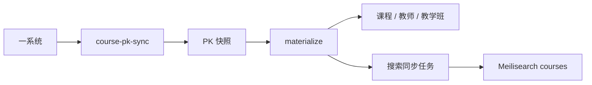

# 课程与排课

课程域有两条主线：

- 课程目录与课评：回答“这门课是什么、谁在教、大家怎么评价”。
- PK 排课器：回答“这一学期我准备怎么排”。

它们共享课程数据，但维护的状态不同。

## 数据从哪里来

在线课程数据由一系统同步进入 PK 域，再物化到课程目录。



本科和研究生是两个独立 audience。即使学期编号相同，凭据、同步状态和课程快照也不会混用。

同步过程会记录 fetch log，并使用 lease version 处理 stale running / failed 任务的续跑。并发 worker 只能有一个成功认领旧 lease，避免两边同时删除或覆盖同一批快照。

## 课程目录怎么建模

课程目录把课程、学期、教学班和教师拆成独立实体。

当前模型至少区分：

- 课程。
- 学期。
- 教学班（offering）。
- 教师。
- 教学班与教师关系。
- 课程 alias / 沿革关系。
- 课评。

教学班是“某学期真实开出来的一班课”，课程则是更稳定的目录实体。

历史导入、在线同步和课评归属都应落到明确的课程 / 教学班身份；课程名只用于辅助匹配。

## 历史课程数据导入

历史 YourTJCourse 数据使用 manifest + JSONL 包导入。

典型流程：

```bash
go run . course-import /path/to/manifest-catalog.yaml --dry-run
go run . course-import /path/to/manifest-catalog.yaml

go run . course-import reviews \
  --manifest /path/to/manifest-reviews.yaml \
  --dry-run

go run . course-import reviews \
  --manifest /path/to/manifest-reviews.yaml

go run . rebuild-course-stats
```

正式导入前先跑 dry-run。manifest 会校验文件 SHA-256 和计数，同一 manifest 重复执行会幂等跳过。

遇到课程代码或教学班归属歧义时，导入器应报告 / quarantine；禁止把评价静默挂到“最像”的课程上。

## 课评为什么公开匿名

公开评价 DTO 不返回论坛作者身份。

审核和身份揭示是两条权限路径：

- CourseManager 可以处理评价状态与举报。
- 更高权限的管理员才能在需要时 reveal 作者。
- reveal 需要理由并进入审计。

公开 DTO 保持无 `userId`。管理页面需要作者信息时，走受审计的 reveal 权限。

## 课程搜索

课程有独立的 `courses` Meilisearch scope。

课程变更时，在数据库事务中写入课程搜索任务；worker 提交后重新读取当前课程状态生成索引。

课评正文不进入全文搜索。

## 排课方案存什么

云端同步以单套方案为单位：每套方案是一条独立的 plan item，带自己的整数 revision，客户端通过 GET / PUT / DELETE `/api/pk/plan-items` 逐方案读写。

服务端校验：

- 最多 10 套方案，超配额返回 409。
- plan id / name 非空。
- 请求体积不超过 1 MiB。

更细的周次、安排 sanitize 由客户端加载路径处理。

历史上同步粒度是整份快照（`/api/pk/plans`，plans / activePlanId / majorSelected / weekView 四字段整体替换）。该路径仍在，但账号完成到逐方案的惰性迁移后，快照读写一律返回 410；迁移会把旧快照中的每套方案复制为 revision=1 的 plan item。

## 两台设备同时改怎么处理

服务端对每套方案用 revision 做 compare-and-swap。

```text
设备 A GET -> plan revision = 3
设备 B GET -> plan revision = 3

设备 A PUT(baseRevision=3) -> 成功，revision 变为 4
设备 B PUT(baseRevision=3) -> 409 Conflict
```

删除同样携带 `baseRevision`；方案已被另一设备删除时返回 410。设备 B 不能把自己的旧版本直接盖上去，需要重新 GET 最新 revision，再按客户端策略对账本地未同步修改。HTTP 边界在 `apps/gooseforum/app/http/controllers/pk/plan_items.go`，compare-and-swap 存储逻辑在 `apps/gooseforum/app/models/forum/pk/plan_item_rep.go`。

这就是多端同步里最重要的约束：**冲突要显式暴露，不能 last-write-wins 静默丢数据。**

Web 当前会保护从未同步或带本地未上传修改的方案，必要时把本地分歧保留为自动恢复方案。

## 修改这个域时重点测什么

课程同步：

- 本科 / 研究生隔离。
- 中断续跑。
- 重复同步幂等。
- materialize 后搜索和统计更新。

课评：

- 匿名 DTO。
- 审核 / reveal 权限。
- 删除与恢复。
- 统计重建。

排课同步：

- 首次登录。
- 离线修改。
- 两端并发。
- 409 冲突。
- 账号切换。
- 方案数量上限。
