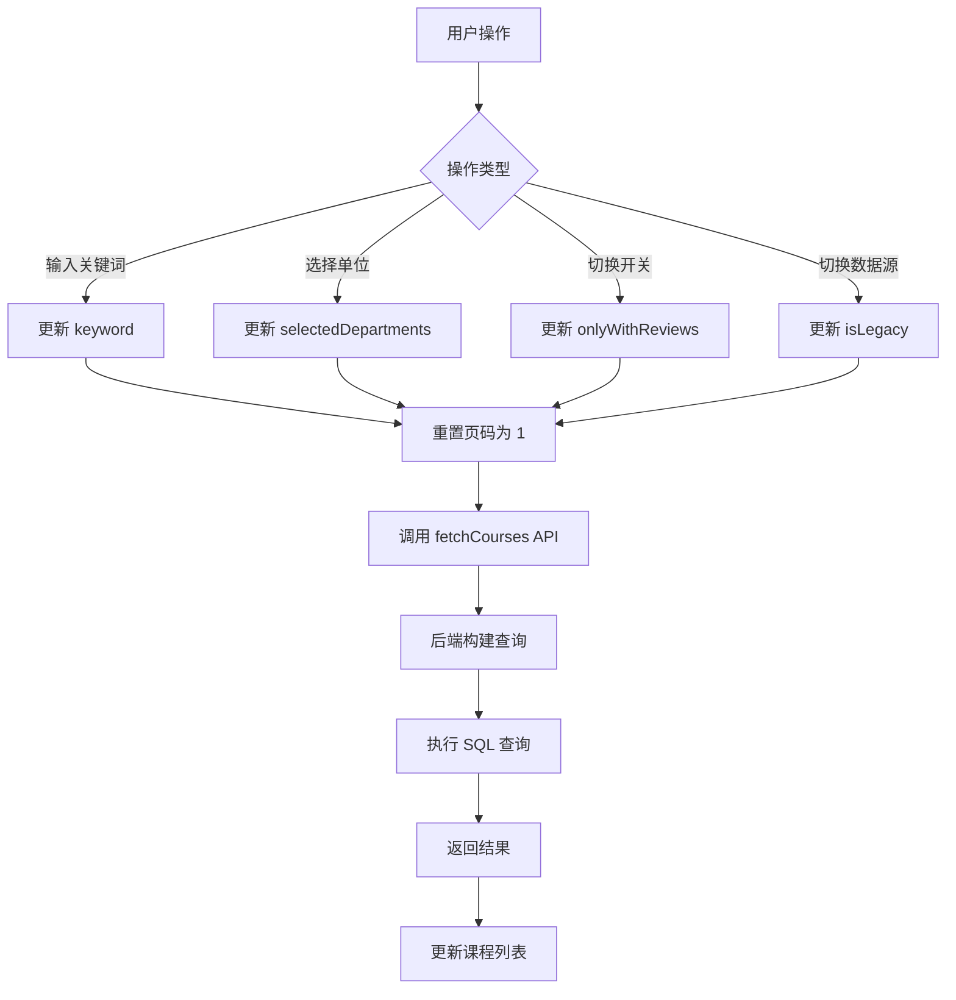

# 筛选逻辑

本文档详细介绍 YourTJ 选课社区的课程筛选功能实现

## 功能概述

课程筛选支持以下维度：

### 基础筛选
- 🔍 **关键词搜索**：搜索课程代码、课程名称、教师姓名
- 📄 **分页加载**：支持分页浏览

### 高级筛选
- 🏫 **开课单位**：多选不同的开课单位
- 📍 **校区**：按校区筛选
- 📖 **课程名称**：精确搜索课程名称
- 🔢 **课程代码**：精确搜索课程代码
- 👤 **教师工号**：按教师工号搜索
- 👨‍🏫 **教师姓名**：精确搜索教师姓名

## 筛选状态接口

```typescript
// 筛选状态接口
export interface FilterState {
  selectedDepartments: string[]   // 已选择的开课单位
  onlyWithReviews: boolean         // 只看有评价
  courseName: string               // 课程名称关键词
  courseCode: string               // 课程代码关键词
  teacherCode: string              // 教师工号
  teacherName: string              // 教师姓名
  campus: string                   // 校区
}

// 高级筛选接口（传递给 API）
export interface CourseAdvancedFilters {
  departments?: string[]
  onlyWithReviews?: boolean
  courseName?: string
  courseCode?: string
  teacherCode?: string
  teacherName?: string
  campus?: string
  faculty?: string  // 院系（预留）
}
```

## 前端实现

### FilterPanel 组件

筛选面板组件提供了完整的筛选界面：

```tsx
interface FilterPanelProps {
  departments: string[]           // 可选的开课单位列表
  filters: FilterState            // 当前筛选状态
  onFilterChange: (filters: FilterState) => void  // 筛选变化回调
}
```

**核心功能：**

1. **开课单位选择**：支持多选/取消选择
2. **校区筛选**：下拉选择校区
3. **课程名称/代码搜索**：文本输入
4. **教师信息搜索**：工号和姓名搜索
5. **只看有评价开关**：快速切换
6. **重置按钮**：一键清空所有筛选条件

**响应式设计：**
- **桌面端**：浮动面板，点击按钮展开/收起
- **移动端**：底部弹窗，全屏显示筛选选项

### 筛选状态管理

使用 React Hooks 管理筛选状态：

```tsx
// Courses.tsx
const [filters, setFilters] = useState<FilterState>({
  selectedDepartments: [],
  onlyWithReviews: false,
  courseName: '',
  courseCode: '',
  teacherCode: '',
  teacherName: '',
  campus: ''
})

const [keyword, setKeyword] = useState('')
const [isLegacy, setIsLegacy] = useState(false)
const [page, setPage] = useState(1)
```

**筛选变化处理：**

```tsx
// 筛选条件变化时自动重新搜索
const handleFilterChange = (newFilters: FilterState) => {
  setFilters(newFilters)
  setPage(1)  // 重置页码
  search(undefined, 1)  // 重新搜索
}

// 监听筛选变化
useEffect(() => {
  search(undefined, 1)
}, [filters])
```

### FilterPanel 组件交互逻辑

**开课单位选择：**

```tsx
const toggleDepartment = (dept: string) => {
  setDraft((prev) => {
    const exists = prev.selectedDepartments.includes(dept)
    const next = exists
      ? prev.selectedDepartments.filter((d) => d !== dept)  // 取消选择
      : [...prev.selectedDepartments, dept]  // 添加选择
    return { ...prev, selectedDepartments: next }
  })
}
```

**应用筛选：**

```tsx
const applyFilters = () => {
  onFilterChange({
    selectedDepartments: uniq(draft.selectedDepartments),  // 去重
    onlyWithReviews: !!draft.onlyWithReviews,
    courseName: draft.courseName.trim(),
    courseCode: draft.courseCode.trim(),
    teacherCode: draft.teacherCode.trim(),
    teacherName: draft.teacherName.trim(),
    campus: draft.campus
  })
  setIsOpen(false)  // 关闭筛选面板
}
```

**重置筛选：**

```tsx
const resetFilters = () => {
  setDraft(defaultFilters)
  onFilterChange(defaultFilters)
  setIsOpen(false)
}
```

### API 调用

**带超时控制的 fetch 封装：**

```typescript
// services/api.ts
async function fetchWithTimeout(
  url: string,
  options?: RequestInit,
  timeout = 15000  // 默认 15 秒超时
) {
  const controller = new AbortController()
  const id = setTimeout(() => controller.abort(), timeout)

  try {
    const res = await fetch(url, {
      ...options,
      signal: controller.signal
    })
    clearTimeout(id)
    return res
  } catch (err) {
    clearTimeout(id)
    throw err
  }
}
```

**课程搜索 API：**

```typescript
export async function fetchCourses(
  keyword?: string,
  legacy?: boolean,
  page = 1,
  limit = 20,
  filters?: CourseAdvancedFilters
) {
  let url = `${API_BASE}/api/courses?page=${page}&limit=${limit}&`

  // 基础参数
  if (keyword) url += `q=${encodeURIComponent(keyword)}&`
  if (legacy) url += `legacy=true&`

  // 筛选参数
  if (filters?.departments && filters.departments.length > 0) {
    url += `departments=${encodeURIComponent(filters.departments.join(','))}&`
  }
  if (filters?.onlyWithReviews) url += `onlyWithReviews=true&`

  // 高级筛选参数
  if (filters?.courseName) url += `courseName=${encodeURIComponent(filters.courseName)}&`
  if (filters?.courseCode) url += `courseCode=${encodeURIComponent(filters.courseCode)}&`
  if (filters?.teacherCode) url += `teacherCode=${encodeURIComponent(filters.teacherCode)}&`
  if (filters?.teacherName) url += `teacherName=${encodeURIComponent(filters.teacherName)}&`
  if (filters?.campus) url += `campus=${encodeURIComponent(filters.campus)}&`

  // 判断是否为复杂筛选（增加超时时间）
  const needHeavyFilter = Boolean(
    filters?.courseName ||
    filters?.teacherName ||
    filters?.teacherCode ||
    filters?.campus
  )

  const res = await fetchWithTimeout(
    url,
    undefined,
    needHeavyFilter ? 25000 : 15000  // 复杂筛选使用 25 秒
  )

  return res.json()
}
```

**开课单位列表 API：**

```typescript
export async function fetchDepartments(legacy?: boolean) {
  const url = `${API_BASE}/api/departments${legacy ? '?legacy=true' : ''}`
  const res = await fetchWithTimeout(url)
  return res.json()
}
```

## 后端实现

### 查询构建

后端接收筛选参数并构建 SQL 查询：

```typescript
app.get('/api/courses', async (c) => {
  const keyword = c.req.query('q')
  const legacy = c.req.query('legacy')
  const departments = c.req.query('departments')
  const onlyWithReviews = c.req.query('onlyWithReviews') === 'true'

  // 高级筛选参数
  const courseName = c.req.query('courseName')
  const courseCode = c.req.query('courseCode')
  const teacherCode = c.req.query('teacherCode')
  const teacherName = c.req.query('teacherName')
  const campus = c.req.query('campus')

  const page = parseInt(c.req.query('page') || '1')
  const limit = parseInt(c.req.query('limit') || '20')
  const offset = (page - 1) * limit

  // 检查是否显示历史数据
  const setting = await c.env.DB.prepare(
    'SELECT value FROM settings WHERE key = ?'
  ).bind('show_legacy_reviews').first<{value: string}>()
  const showIcu = setting?.value === 'true'

  let baseWhere = ' WHERE 1=1'
  let params: string[] = []

  // 历史数据过滤
  if (!showIcu) {
    baseWhere += ' AND (c.is_icu = 0 OR c.is_icu IS NULL)'
  }

  // 历史数据筛选
  if (legacy === 'true') {
    baseWhere += ' AND c.is_legacy = 1'
  } else {
    baseWhere += ' AND c.is_legacy = 0'
  }

  // 关键词搜索（覆盖多个字段）
  if (keyword) {
    baseWhere += ' AND (c.search_keywords LIKE ? OR c.code LIKE ? OR c.name LIKE ? OR t.name LIKE ?)'
    const likeKey = `%${keyword}%`
    params = [likeKey, likeKey, likeKey, likeKey]
  }

  // 开课单位筛选（多选）
  if (departments) {
    const deptList = departments.split(',').filter(d => d.trim())
    if (deptList.length > 0) {
      const placeholders = deptList.map(() => '?').join(',')
      baseWhere += ` AND c.department IN (${placeholders})`
      params.push(...deptList)
    }
  }

  // 只看有评价
  if (onlyWithReviews) {
    baseWhere += ' AND c.review_count > 0'
  }

  // ===== 高级筛选条件 =====

  // 课程名称精确搜索
  if (courseName) {
    baseWhere += ' AND c.name LIKE ?'
    params.push(`%${courseName}%`)
  }

  // 课程代码精确搜索
  if (courseCode) {
    baseWhere += ' AND c.code LIKE ?'
    params.push(`%${courseCode}%`)
  }

  // 教师工号搜索
  if (teacherCode) {
    baseWhere += ' AND t.tid LIKE ?'
    params.push(`%${teacherCode}%`)
  }

  // 教师姓名精确搜索
  if (teacherName) {
    baseWhere += ' AND t.name LIKE ?'
    params.push(`%${teacherName}%`)
  }

  // 校区筛选（如果数据库有 campus 字段）
  if (campus) {
    baseWhere += ' AND c.campus = ?'
    params.push(campus)
  }

  // 执行查询
  const countQuery = `SELECT COUNT(*) as total FROM courses c LEFT JOIN teachers t ON c.teacher_id = t.id${baseWhere}`
  const countResult = await c.env.DB.prepare(countQuery).bind(...params).first()
  const total = countResult?.total || 0

  const query = `SELECT c.*, t.name as teacher_name, t.title as teacher_title
                 FROM courses c
                 LEFT JOIN teachers t ON c.teacher_id = t.id
                 ${baseWhere}
                 ORDER BY c.id DESC
                 LIMIT ? OFFSET ?`

  const { results } = await c.env.DB.prepare(query)
    .bind(...params, limit, offset)
    .all()

  return c.json({
    data: results || [],
    total,
    page,
    limit,
    totalPages: Math.ceil(total / limit)
  })
})
```

### 开课单位列表

```typescript
app.get('/api/departments', async (c) => {
  const legacy = c.req.query('legacy')

  const setting = await c.env.DB.prepare(
    'SELECT value FROM settings WHERE key = ?'
  ).bind('show_legacy_reviews').first<{value: string}>()
  const showIcu = setting?.value === 'true'

  let whereClause = ' WHERE department IS NOT NULL AND department != ""'

  if (!showIcu) {
    whereClause += ' AND (is_icu = 0 OR is_icu IS NULL)'
  }

  if (legacy === 'true') {
    whereClause += ' AND is_legacy = 1'
  } else {
    whereClause += ' AND is_legacy = 0'
  }

  const query = `SELECT DISTINCT department FROM courses ${whereClause} ORDER BY department`
  const { results } = await c.env.DB.prepare(query).all()

  const departments = (results || []).map((row: any) => row.department)
  return c.json({ departments })
})
```

## 筛选流程



## 搜索优化

### search_keywords 字段

课程表包含 `search_keywords` 字段，用于优化搜索：

```sql
-- 创建课程时自动生成搜索关键词
INSERT INTO courses (code, name, teacher_id, search_keywords)
VALUES (?, ?, ?, ?)
-- search_keywords = "CS101 计算机导论 张三"
```

### 搜索范围

关键词搜索覆盖以下字段：

1. `search_keywords` - 预生成的搜索关键词
2. `code` - 课程代码
3. `name` - 课程名称
4. `teacher.name` - 教师姓名

## 分页实现

### 前端分页

```tsx
const [page, setPage] = useState(1)
const [hasMore, setHasMore] = useState(true)

// 加载更多
const loadMore = async () => {
  const result = await fetchCourses(
    keyword, isLegacy, page + 1, 20,
    selectedDepartments, onlyWithReviews
  )
  setCourses([...courses, ...result.data])
  setPage(page + 1)
  setHasMore(page + 1 < result.totalPages)
}
```

### 后端分页

```typescript
const page = parseInt(c.req.query('page') || '1')
const limit = parseInt(c.req.query('limit') || '20')
const offset = (page - 1) * limit

// 获取总数
const countResult = await c.env.DB.prepare(countQuery).bind(...params).first()
const total = countResult?.total || 0

// 获取分页数据
const { results } = await c.env.DB.prepare(query)
  .bind(...params, limit, offset).all()

return c.json({
  data: results,
  total,
  page,
  limit,
  totalPages: Math.ceil(total / limit)
})
```

## 性能考虑

### 索引使用

确保以下字段有索引：

```sql
CREATE INDEX idx_courses_department ON courses(department);
CREATE INDEX idx_courses_legacy ON courses(is_legacy);
CREATE INDEX idx_courses_review_count ON courses(review_count);
```

### 查询优化

- 使用 `LIKE` 时避免前缀通配符
- 限制返回字段数量
- 合理设置分页大小

## 下一步

- [验证系统](/development/verification) - 了解管理员验证
- [API 接口](/development/api) - 查看完整 API 文档
