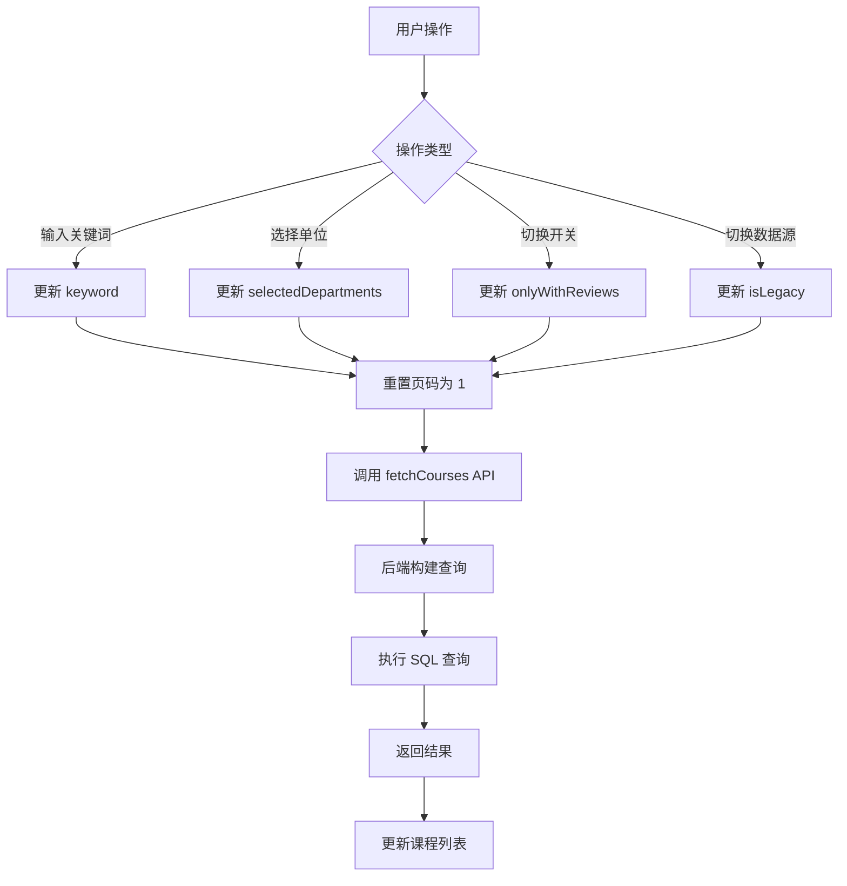

# 筛选逻辑

本文档详细介绍 YourTJ 选课社区的课程筛选功能实现

## 功能概述

课程筛选支持以下维度：

- 🔍 关键词搜索
- 🏫 开课单位筛选
- ⭐ 只看有评价的课程
- 📚 历史数据切换
- 📄 分页加载

## 前端实现

### FilterPanel 组件

```tsx
interface FilterPanelProps {
  departments: string[]           // 可选的开课单位列表
  selectedDepartments: string[]   // 已选择的开课单位
  onDepartmentChange: (departments: string[]) => void
  onlyWithReviews: boolean        // 只看有评价
  onOnlyWithReviewsChange: (value: boolean) => void
}
```

### 筛选状态管理

```tsx
// Courses.tsx
const [keyword, setKeyword] = useState('')
const [selectedDepartments, setSelectedDepartments] = useState<string[]>([])
const [onlyWithReviews, setOnlyWithReviews] = useState(false)
const [isLegacy, setIsLegacy] = useState(false)
const [page, setPage] = useState(1)
```

### API 调用

```typescript
// services/api.ts
export async function fetchCourses(
  keyword?: string,
  legacy?: boolean,
  page = 1,
  limit = 20,
  departments?: string[],
  onlyWithReviews?: boolean
) {
  let url = `${API_BASE}/api/courses?page=${page}&limit=${limit}&`

  if (keyword) url += `q=${encodeURIComponent(keyword)}&`
  if (legacy) url += `legacy=true&`
  if (departments && departments.length > 0) {
    url += `departments=${encodeURIComponent(departments.join(','))}&`
  }
  if (onlyWithReviews) url += `onlyWithReviews=true&`

  const res = await fetchWithTimeout(url)
  return res.json()
}
```

## 后端实现

### 查询构建

```typescript
app.get('/api/courses', async (c) => {
  const keyword = c.req.query('q')
  const legacy = c.req.query('legacy')
  const departments = c.req.query('departments')
  const onlyWithReviews = c.req.query('onlyWithReviews') === 'true'
  const page = parseInt(c.req.query('page') || '1')
  const limit = parseInt(c.req.query('limit') || '20')
  const offset = (page - 1) * limit

  // 检查是否显示乌龙茶数据
  const setting = await c.env.DB.prepare(
    'SELECT value FROM settings WHERE key = ?'
  ).bind('show_legacy_reviews').first<{value: string}>()
  const showIcu = setting?.value === 'true'

  let baseWhere = ' WHERE 1=1'
  let params: string[] = []

  // 乌龙茶数据过滤
  if (!showIcu) {
    baseWhere += ' AND (c.is_icu = 0 OR c.is_icu IS NULL)'
  }

  // 历史数据筛选
  if (legacy === 'true') {
    baseWhere += ' AND c.is_legacy = 1'
  } else {
    baseWhere += ' AND c.is_legacy = 0'
  }

  // 关键词搜索
  if (keyword) {
    baseWhere += ' AND (c.search_keywords LIKE ? OR c.code LIKE ? OR c.name LIKE ? OR t.name LIKE ?)'
    const likeKey = `%${keyword}%`
    params = [likeKey, likeKey, likeKey, likeKey]
  }

  // 开课单位筛选
  if (departments) {
    const deptList = departments.split(',').filter(d => d.trim())
    if (deptList.length > 0) {
      const placeholders = deptList.map(() => '?').join(',')
      baseWhere += ` AND c.department IN (${placeholders})`
      params.push(...deptList)
    }
  }

  // 只看有评价
  if (onlyWithReviews) {
    baseWhere += ' AND c.review_count > 0'
  }

  // 执行查询...
})
```

### 开课单位列表

```typescript
app.get('/api/departments', async (c) => {
  const legacy = c.req.query('legacy')

  const setting = await c.env.DB.prepare(
    'SELECT value FROM settings WHERE key = ?'
  ).bind('show_legacy_reviews').first<{value: string}>()
  const showIcu = setting?.value === 'true'

  let whereClause = ' WHERE department IS NOT NULL AND department != ""'

  if (!showIcu) {
    whereClause += ' AND (is_icu = 0 OR is_icu IS NULL)'
  }

  if (legacy === 'true') {
    whereClause += ' AND is_legacy = 1'
  } else {
    whereClause += ' AND is_legacy = 0'
  }

  const query = `SELECT DISTINCT department FROM courses ${whereClause} ORDER BY department`
  const { results } = await c.env.DB.prepare(query).all()

  const departments = (results || []).map((row: any) => row.department)
  return c.json({ departments })
})
```

## 筛选流程



## 搜索优化

### search_keywords 字段

课程表包含 `search_keywords` 字段，用于优化搜索：

```sql
-- 创建课程时自动生成搜索关键词
INSERT INTO courses (code, name, teacher_id, search_keywords)
VALUES (?, ?, ?, ?)
-- search_keywords = "CS101 计算机导论 张三"
```

### 搜索范围

关键词搜索覆盖以下字段：

1. `search_keywords` - 预生成的搜索关键词
2. `code` - 课程代码
3. `name` - 课程名称
4. `teacher.name` - 教师姓名

## 分页实现

### 前端分页

```tsx
const [page, setPage] = useState(1)
const [hasMore, setHasMore] = useState(true)

// 加载更多
const loadMore = async () => {
  const result = await fetchCourses(
    keyword, isLegacy, page + 1, 20,
    selectedDepartments, onlyWithReviews
  )
  setCourses([...courses, ...result.data])
  setPage(page + 1)
  setHasMore(page + 1 < result.totalPages)
}
```

### 后端分页

```typescript
const page = parseInt(c.req.query('page') || '1')
const limit = parseInt(c.req.query('limit') || '20')
const offset = (page - 1) * limit

// 获取总数
const countResult = await c.env.DB.prepare(countQuery).bind(...params).first()
const total = countResult?.total || 0

// 获取分页数据
const { results } = await c.env.DB.prepare(query)
  .bind(...params, limit, offset).all()

return c.json({
  data: results,
  total,
  page,
  limit,
  totalPages: Math.ceil(total / limit)
})
```

## 性能考虑

### 索引使用

确保以下字段有索引：

```sql
CREATE INDEX idx_courses_department ON courses(department);
CREATE INDEX idx_courses_legacy ON courses(is_legacy);
CREATE INDEX idx_courses_review_count ON courses(review_count);
```

### 查询优化

- 使用 `LIKE` 时避免前缀通配符
- 限制返回字段数量
- 合理设置分页大小

## 下一步

- [验证系统](/development/verification) - 了解管理员验证
- [API 接口](/development/api) - 查看完整 API 文档
