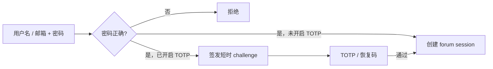
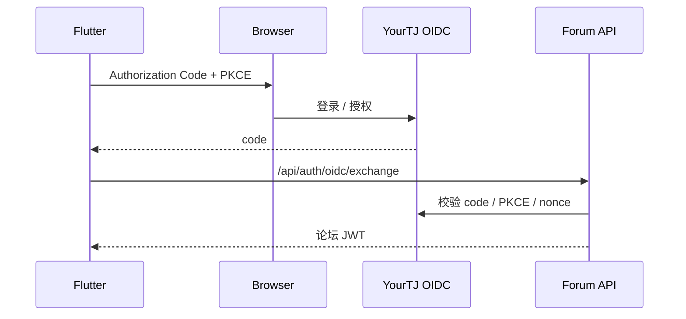

# 身份与 OIDC

YourTJ 把“用户是谁”和“这次怎么登录”分开处理。

内部身份始终是数值 `users.id`。密码、OAuth、OIDC、JWT、校园身份都围绕这个 ID 工作，但都不会替代它。

## Web 登录

Web 支持：

- 密码。
- GitHub OAuth。
- Google OAuth（实例配置后）。

OAuth 只登录或绑定已有账号，不自动创建新用户。

密码登录可以开启 TOTP。流程是：

TOTP challenge 只有短时效，并且成功使用后会被消费。恢复码也是一次性的。密码登录入口可从 `apps/gooseforum/app/http/controllers/api/authController.go` 跟踪。

## Session 为什么既有 JWT 又有数据库记录

论坛 JWT 带有唯一 `jti`，服务端同时维护 `user_sessions`。

JWT 验证 token 是否由平台签发；会话记录判断该 token 当前是否有效。

这套设计支持：

- 单独撤销一台设备。
- 退出当前设备。
- 一次退出所有设备。
- 修改密码后让旧 token 失效。

“退出所有设备”和修改密码还会提升 `TokenVersion`，作为第二层失效条件。

## Flutter 为什么不直接保存 OIDC token

Flutter 使用内建 OIDC Provider 完成浏览器授权：

1. App 生成 PKCE verifier / challenge 和 nonce。
2. 浏览器进入 `/api/oauth`。
3. 用户完成 YourTJ 登录和授权。
4. App 拿到一次性 authorization code。
5. App 调用 `POST /api/auth/oidc/exchange`。
6. 服务端再次检查 code、PKCE、nonce、redirect URI 和 `sub`。
7. 服务端签发普通论坛 JWT。

App 后续访问论坛 API 时统一使用论坛 session；OIDC token 只参与授权交换。交换入口位于 `apps/gooseforum/app/http/controllers/api/oidcController.go`，Provider 逻辑在 `apps/gooseforum/app/service/oidcservice/`。

OIDC Provider 的 `sub` 固定为十进制 `users.id`，第一方客户端和论坛内部使用同一个身份值。

## 浏览器和 App 的凭据边界

| 客户端 | 凭据 | 额外保护 |
| --- | --- | --- |
| Web | HttpOnly Cookie | CSRF |
| Flutter | 论坛 JWT Bearer | 系统安全存储 |
| Agent | `agt_` Bearer | bot actor 隔离 |

浏览器 JavaScript 不读取 Cookie 中的 session token，也不需要为 same-origin API 手工拼 `Authorization`。

## Agent 为什么单独做身份类型

Agent 使用独立 bot actor 和独立凭据，与普通用户登录凭据分开。

Agent 用户显式标记为 bot，并使用独立 credential。它不能：

- 密码登录。
- OAuth 登录。
- 配置 TOTP。
- 创建人类会话。

这样即使 Agent token 泄漏，认证路径也不会把它升级成人类登录凭据。

详见[Agents 与 MCP](/development/agents-mcp)。

## 校园身份不参与登录

“我的校园”绑定的是学校官方身份。绑定记录指向已有 YourTJ 用户，但学校 student ID 不会成为：

- `users.id`。
- OIDC `sub`。
- 公开 profile 标识。
- 搜索字段。

校园凭据只服务于私密校园数据读取。

## 修改认证代码时至少检查

- 密码错误。
- TOTP / recovery code 错误。
- challenge 重放。
- session revoke。
- frozen / deleted / bot 用户。
- OAuth 未绑定账号不能自动建号。
- OIDC redirect / state / nonce / PKCE。
- Cookie 写请求的 CSRF。
- Bearer 客户端不被 Cookie 逻辑误伤。
