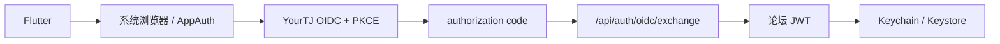

# 移动端

Flutter 客户端位于 `apps/mobile`，使用 Melos 管理 workspace。

首页、话题、发布、课程、排课、Wiki 和“我的校园”等日常路径使用原生 Flutter 页面。管理工作区和部分认证交接使用受控浏览器页面。

## Workspace

| Package | 负责什么 |
| --- | --- |
| `core` | API、模型、Markdown、契约镜像 |
| `auth` | 密码 / OIDC、令牌存储、会话 |
| `ui_kit` | YourTJ 设计 token 和组件 |
| `forum_app` | 页面、路由、业务状态和平台集成 |

初始化：

```bash
cd apps/mobile
melos bootstrap
melos run analyze
melos run test
```

## 一次登录怎么完成

App 不直接收集 GitHub / Google 密码，也不把 OIDC token 当成长期论坛会话凭据。



之后普通 API 请求统一使用论坛 JWT。

Android Emulator 调试时，为了让 issuer 保持 `localhost`，使用：

```bash
adb reverse tcp:5234 tcp:5234
```

不要把 OIDC issuer 临时改成 `10.0.2.2`；issuer、authorization endpoint 和交换校验需要保持同一身份空间。

## 根导航和页面边界

当前根级导航包含 Home、Campus、Notifications 和 Messages。

搜索、话题、课程、Wiki、设置等作为二级页面 push 进入。iOS 使用平台原生转场和左缘返回手势；Android 保持项目自己的过渡。

管理页面不在 Flutter 中重新实现一套。需要管理员权限的工作区会通过第一方受控 Web 页面打开，并继续使用服务端权限判断。

## 本地状态必须按账号隔离

本地状态至少按 API origin 和账号 ID 隔离，确保同一设备切换账号时不会串用旧状态。

草稿、搜索记录、pending interaction、排课同步状态等需要至少区分：

```text
API origin + numeric user id
```

切换账号后，旧账号的点赞乐观状态、校园私密数据或未同步排课不能继续出现在新账号上下文。

### 校园数据

校园成绩、课表和消息只存在页面内存。

离开 Campus、切换 session 或 App 进入后台时，应清理私密视图并取消在途请求；这些数据不进入通用离线缓存。

### 聊天 outbox

发送中的消息可以在当前 session 内保留，以便离开会话再回来仍能看到发送状态。

文本消息的 outbox 不跨 App 终止持久化。图片发送意图会写入账号级安全存储用于恢复，但恢复出来的是显式重试项，不会自动重发网络请求。

每条待发消息都带客户端生成的幂等 key：`clientMessageId`（16 字节随机 hex；服务端字段可选，上限 64 字符），随 `POST /api/forum/chat/send` 提交。服务端在事务内按 `(sender_id, client_message_id)` 查重：key 已存在且内容、消息类型、回复目标全部一致时视为重放，直接返回成功，不重复落库、不重复推送；任何一项不一致则返回业务错误；该组合上的唯一索引兜底并发。因此网络结果不明确时重试是安全的，不会产生重复消息。

两个边界值得知道：已提交的重试即使双方此后互相拉黑也按成功返回，权限检查只拦新写入；消息列表不回显 `clientMessageId`，outbox 对已发送气泡的对账按发送者、内容、类型和 afterId 启发式匹配——API 确认的是会话，不是消息 ID。

实现入口：客户端 `apps/mobile/packages/forum_app/lib/src/messages/chat_outbox.dart`，服务端 `apps/gooseforum/app/service/chatservice/chatservice.go`，契约测试 `apps/gooseforum/app/http/routes/contract_chat_idempotency_test.go`。

## 排课同步

Flutter 和 Web 使用同一 `/api/pk/plan-items` 逐方案同步语义：每套方案带服务端 revision，PUT / DELETE 携带 `baseRevision` 做 compare-and-swap。

本地修改先可靠保存，再尝试上传；服务端 409（revision 已变）或 410（方案已被另一设备删除）时重新读取云端并对账。账号切换后必须重新建立同步基线。

不要为了“离开页面时看起来同步了”就先推进本地 revision，再异步写磁盘。移动系统可能随时暂停进程。

## 推送

原生推送是可选增强通道。

- iOS：APNs。
- Android：JPush / OEM，以及配置的 FCM provider。

只有用户明确同意、系统权限允许、设备 token 获取成功并完成服务端注册后，UI 才应显示已启用。

配置缺失或注册失败都应保持真实关闭 / 错误状态。

## 设计和 API 契约

Flutter token：

```text
apps/mobile/packages/ui_kit/lib/src/theme/tokens.json
```

它与 Web `tokens.css` 同步维护。

Dart API mirror 位于 `core/lib/src/gen/`，目前仍手工维护。移动端实际使用的 API 变更，需要同一 PR 更新 mirror 和反序列化测试。

公开商店分发、部分 native push 和学校登录真机链路仍需要生产环境验证。代码路径存在不等于这些外部链路已经完成验收。
