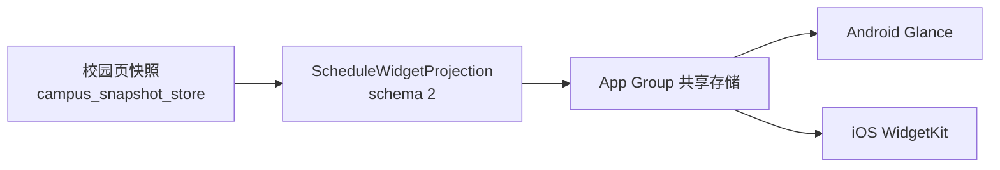

# 桌面小组件

移动端在 Android（Glance）和 iOS（WidgetKit）上提供三种桌面课表小组件：下一节课、今日课表和课程时间线。小组件不联网，渲染所需的数据全部来自 App 提前写入的本地快照。

## 数据流

- **快照来源**：校园页把 profile / calendar / timetable / today 四类数据以单行原子快照写入离线存储（`lib/src/offline/campus_snapshot_store.dart`）。小组件只消费这份快照，不发起新的学校请求。
- **Projection 生成**：`ScheduleWidgetProjection.fromSnapshot` 把官方课表整理成 schema 2 的投影（`lib/src/campus_widget/schedule_widget_projection.dart`）：当日保留服务端的权威结果，校历规则可靠时再推算出八天滚动窗口；时区固定 `Asia/Shanghai`，超过 `staleAfter`（7 天）未更新即视为过期。
- **共享存储**：投影经 `ScheduleWidgetBridge` 写入 App Group `group.tj.yourtj.forumApp.widgets`（键 `schedule_widget_projection`），这是 Flutter 与原生代码之间唯一的交换通道。
- **原生只读**：Android Glance 和 iOS WidgetKit 从共享存储读取投影后自行渲染时间线，不回读 App 数据库，也不读取排课器 store——小组件上永远是官方课表，不包含用户自建的排课方案。

## 隐私边界

投影剔除了姓名、学号、邮箱、成绩、消息和凭据；身份字段只保留 `siteKey`、`accountScope` 和 `bindingRevision`，用于判断数据属于哪个账号作用域，而不是可读的个人信息。

因此落到桌面的内容只有：课程名、教室、教师、起止时间、教学周和调课标签。换账号、登出或 401 会话失效时，`clearOfflineCache` 会调用 `widgetBridge.clear(state: 'signedOut')` 写入终态，避免下一账号在桌面看到上一账号的课表。

## 写入与刷新

`ScheduleWidgetBridge`（`lib/src/campus_widget/schedule_widget_bridge.dart`）的写入有几层保护：

- **两段式落盘**：先写临时键 `schedule_widget_projection_pending`，读回校验能完整反序列化后再提升为正式键，最后清掉临时键。写到一半被杀进程不会留下半份数据。
- **代际隔离**：离线缓存 epoch 变化时 `invalidate()` 递增 generation，仍在队列里的旧写入直接作废，防止旧账号数据写进新会话。
- **定时刷新**：写入完成后按 `updateTimesAfter` 预约 Android 三个 receiver 的下次更新；iOS 由 WidgetKit 时间线驱动。

小组件的背景透明度可在 App 内设置，范围 0–15%（默认 9%），同样存在 App Group 里（键 `schedule_widget_transparency_percent`）。小组件点击后通过深链回到 App，由 `scheduleWidgetLinkProvider` 接收。

## 平台实现

| 层 | 位置 |
| --- | --- |
| Flutter 桥接 | `apps/mobile/packages/forum_app/lib/src/campus_widget/schedule_widget_bridge.dart` |
| 投影模型 | `apps/mobile/packages/forum_app/lib/src/campus_widget/schedule_widget_projection.dart` |
| Android Glance | `apps/mobile/packages/forum_app/android/app/src/main/kotlin/tj/yourtj/forum_app/widget/ScheduleWidgets.kt` |
| iOS WidgetKit | `apps/mobile/packages/forum_app/ios/ScheduleWidgets/ScheduleWidgets.swift` |
| home_widget 插件 | `apps/mobile/third_party/home_widget/`（仓库内 vendor，非 pub 依赖） |

Android 侧三个 receiver（`NextClassWidgetReceiver` / `TodayScheduleWidgetReceiver` / `CourseTimelineWidgetReceiver`）继承 vendored 插件的 `HomeWidgetGlanceWidgetReceiver`；iOS 侧是同一个 App Group 下的 WidgetBundle。两端的布局各自实现，但共享同一份投影，字段语义以投影模型为准。

结构契约由 `apps/mobile/packages/forum_app/test/native_widget_structure_test.dart` 守护：改动原生文件路径、receiver 类名或 App Group 标识时，该测试会先于真机发现问题。
