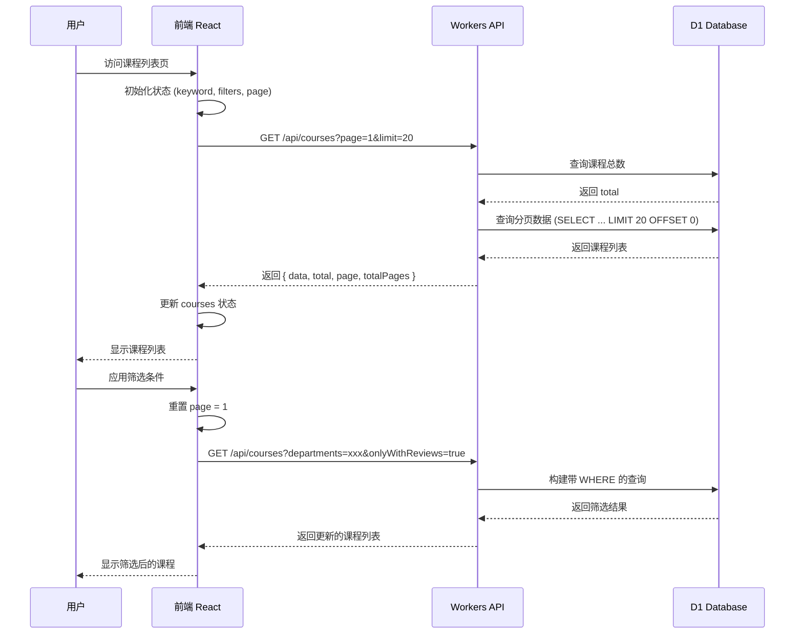
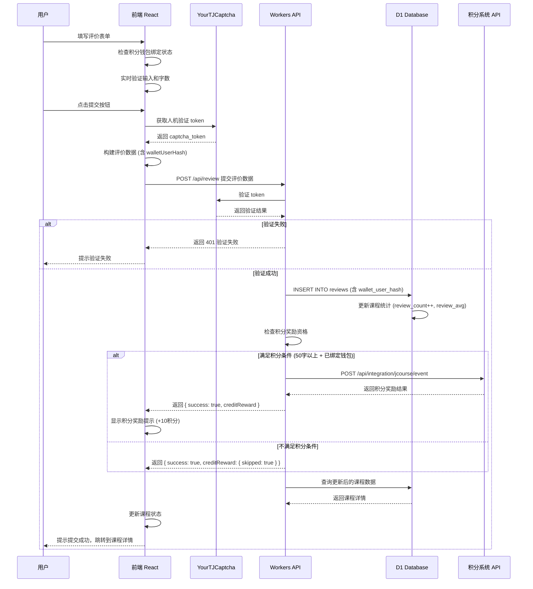
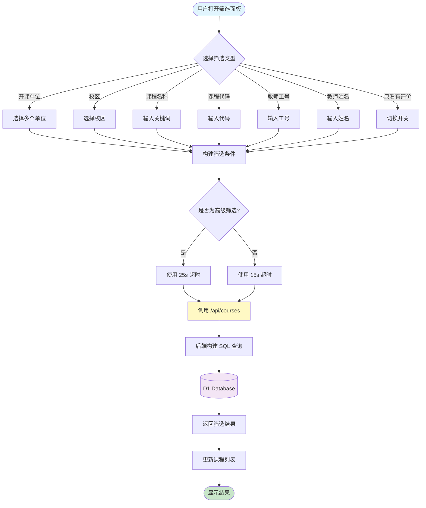
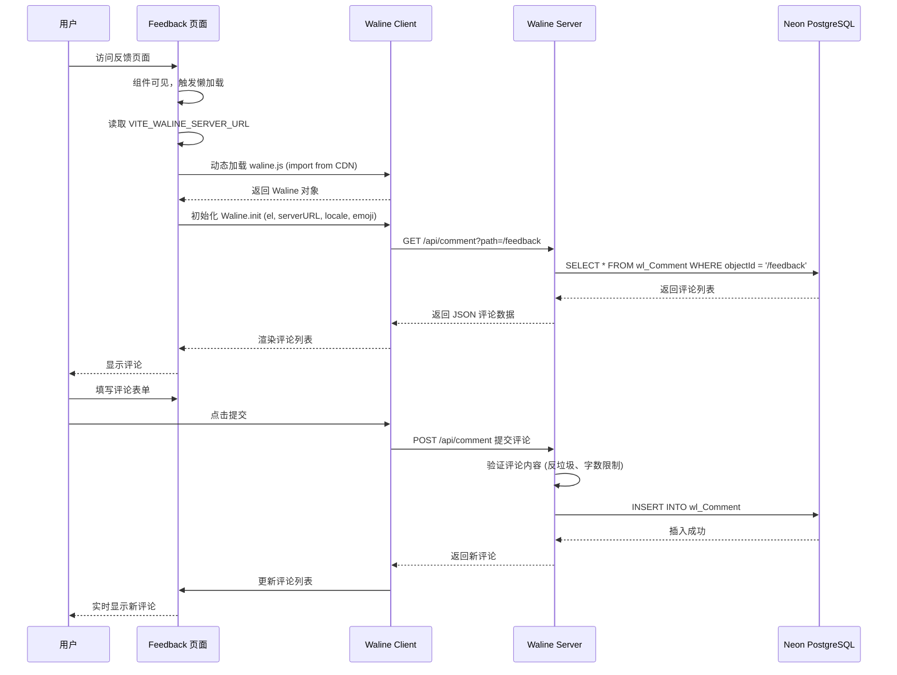
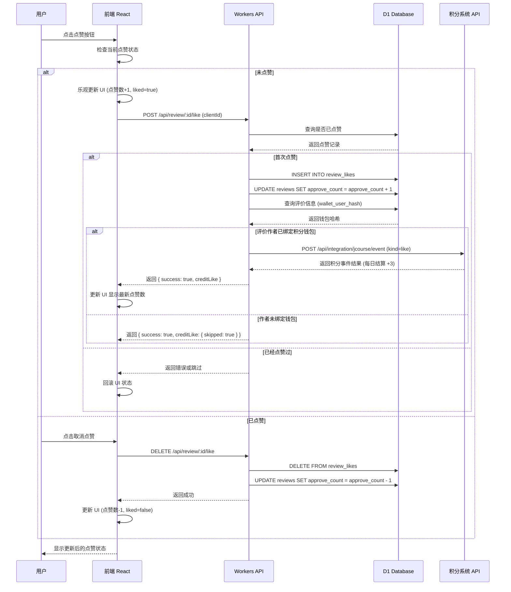

# 开发概述

本章节详细介绍 YourTJ 项目的技术实现细节，帮助开发者深入理解项目架构。

YourTJ 包含两个核心项目：
- **选课社区**：课程评价与选课指南平台
- **积分系统**：去中心化钱包 + 任务/商品交易 + 管理后台

---

## 选课社区技术栈

### 前端技术

| 技术 | 版本 | 用途 |
|------|------|------|
| React | 18.2.0 | UI 框架 |
| TypeScript | 5.3.0 | 类型安全 |
| Vite | 5.0.0 | 构建工具 |
| React Router | 6.21.0 | 路由管理 |
| Framer Motion | 12.25.0 | 动画效果 |
| Tailwind CSS | CDN | 样式框架（通过 CDN 引入） |

### 后端技术

| 技术 | 用途 |
|------|------|
| Cloudflare Workers | Serverless 运行时 |
| Hono | Web 框架 |
| D1 Database | SQLite 数据库 |
| Sqids | ID 编码 |

### 外部服务

| 服务 | 用途 |
|------|------|
| YourTJCaptcha | 人机验证 |
| Waline | 评论系统 |
| Neon | PostgreSQL 数据库（Waline） |
| Vercel | 服务托管 |

### 选课社区架构

```
┌─────────────────────────────────────────────────────────────────┐
│                         用户浏览器                               │
└─────────────────────────────────────────────────────────────────┘
                                │
                                ▼
┌─────────────────────────────────────────────────────────────────┐
│                    Cloudflare CDN / Pages                        │
│                      (静态资源托管)                               │
└─────────────────────────────────────────────────────────────────┘
                                │
        ┌───────────────────────┼───────────────────────┐
        ▼                       ▼                       ▼
┌───────────────┐     ┌───────────────┐     ┌───────────────┐
│   React SPA   │     │   Workers     │     │    Waline     │
│   (Frontend)  │────▶│   (Backend)   │     │   (Comments)  │
└───────────────┘     └───────────────┘     └───────────────┘
                              │                     │
                              ▼                     ▼
                      ┌───────────────┐     ┌───────────────┐
                      │  D1 Database  │     │     Neon      │
                      │   (SQLite)    │     │  (PostgreSQL) │
                      └───────────────┘     └───────────────┘
```

---

## 积分系统技术栈

### 前端技术

| 技术 | 用途 |
|------|------|
| React | UI 框架 |
| TypeScript | 类型安全 |
| Vite | 构建工具 |
| Tailwind CSS | 样式框架 |

### 后端技术

| 技术 | 用途 |
|------|------|
| Vercel Serverless Functions | Serverless 运行时 |
| Turso (libSQL) | 边缘 SQLite 数据库 |

### 安全特性

| 技术 | 用途 |
|------|------|
| PBKDF2 | 密钥派生（学号+PIN → 助记词） |
| HMAC-SHA256 | 请求签名（防重放） |
| JWT | 管理员认证 |

### 积分系统架构

```
┌─────────────────────────────────────────────────────────────────┐
│                         用户浏览器                               │
│                    (React 前端 + 密钥派生)                        │
└─────────────────────────────────────────────────────────────────┘
                                │
                                ▼
┌─────────────────────────────────────────────────────────────────┐
│                      Vercel Edge Network                         │
│                      (静态资源托管)                               │
└─────────────────────────────────────────────────────────────────┘
                                │
        ┌───────────────────────┴───────────────────────┐
        ▼                                               ▼
┌───────────────────────┐                 ┌───────────────────────┐
│   backend-core        │                 │   backend-market      │
│   /api/wallet/*       │                 │   /api/task/*         │
│   /api/transaction/*  │                 │   /api/product/*      │
│   /api/admin/*        │                 │   /api/report/*       │
└───────────────────────┘                 └───────────────────────┘
        │                                               │
        └───────────────────────┬───────────────────────┘
                                ▼
              ┌─────────────────────────────────┐
              │   Turso Database (libSQL)       │
              │   钱包/交易/任务/商品/举报       │
              └─────────────────────────────────┘
```

---

## 数据流详解

### 课程列表加载流程



### 评价提交流程



### 高级筛选流程



### 评论系统流程



### 点赞积分流程



---

## 选课社区核心模块

### 前端模块

```
frontend/src/
├── components/          # 可复用组件
│   ├── Navbar.tsx         # 导航栏
│   ├── BottomNavigation.tsx # 移动端底部导航
│   ├── GlassCard.tsx      # 玻璃态卡片
│   ├── FilterPanel.tsx    # 筛选面板
│   ├── MarkdownEditor.tsx # Markdown 编辑器
│   └── TemplateSelector.tsx # 评价模板选择器
│
├── pages/               # 页面组件
│   ├── Courses.tsx        # 课程列表页
│   ├── Course.tsx         # 课程详情页
│   ├── WriteReview.tsx    # 写评价页
│   ├── Admin.tsx          # 管理后台
│   ├── About.tsx          # 关于页面
│   ├── FAQ.tsx            # 常见问题
│   └── Feedback.tsx       # 反馈页面
│
├── services/            # API 服务
│   └── api.ts             # API 调用封装
│
└── App.tsx              # 应用入口
```

### 后端模块

```
backend/src/
├── index.ts             # 主入口，路由定义
└── sqids.ts             # ID 编码工具
```

---

## 积分系统核心模块

### 前端模块

```
frontend/src/
├── components/          # 可复用组件
├── pages/               # 页面组件
│   ├── Wallet.tsx        # 钱包页面
│   ├── Task.tsx          # 任务市场
│   ├── Product.tsx       # 商品市场
│   ├── Admin.tsx         # 管理后台
│   └── Report.tsx        # 申诉/举报
│
└── shared/              # 共享工具
    └── utils/            # 加密、签名等工具
```

### 后端模块

```
backend-core/
├── api/                 # Core API
│   ├── wallet/           # 钱包接口
│   ├── transaction/      # 交易接口
│   ├── admin/            # 管理接口
│   └── redeem/           # 兑换码接口
│
└── shared/              # 前后端共享代码
    └── utils/            # 加密、签名工具

backend-market/
├── api/                 # Market API
│   ├── task/             # 任务接口
│   ├── product/          # 商品接口
│   └── report/           # 举报接口
│
└── shared/              # 前后端共享代码
```

---

## 开发规范

### 代码风格

- 使用 TypeScript 严格模式
- 组件使用函数式写法 + Hooks
- 样式使用 Tailwind CSS 工具类
- API 调用统一封装在 services 目录

### 命名规范

| 类型 | 规范 | 示例 |
|------|------|------|
| 组件文件 | PascalCase | `CourseCard.tsx` |
| 工具文件 | camelCase | `api.ts` |
| CSS 类名 | kebab-case | `course-card` |
| 常量 | UPPER_SNAKE_CASE | `API_BASE_URL` |

### Git 提交规范

遵循 Conventional Commits：

```
feat: 新功能
fix: Bug 修复
docs: 文档更新
style: 代码格式
refactor: 重构
perf: 性能优化
test: 测试
chore: 构建/工具
```

---

## 文档导航

### 选课社区

#### 架构详解
- [前端架构](/development/frontend) - React 组件设计
- [后端架构](/development/backend) - Workers API 设计
- [数据表结构](/development/database) - D1 数据库设计
- [API 接口](/development/api) - RESTful API 文档

#### 核心功能
- [筛选逻辑](/development/filtering) - 课程筛选实现
- [验证系统](/development/verification) - 管理员验证
- [人机验证](/development/captcha) - YourTJCaptcha 集成
- [评论系统](/development/comments) - Waline 集成
- [唯一标识符](/development/sqids) - Sqids ID 编码

#### 部署配置
- [环境变量](/development/env-variables) - 配置参考
- [Cloudflare Workers](/development/cloudflare) - Workers 部署
- [Waline 部署](/development/waline) - 评论系统部署

### 积分系统

#### 项目文档
- [GitHub 仓库](https://github.com/YourTongji/YourTJ-Credit-Serverless) - 源代码与详细文档
- [项目 README](https://github.com/YourTongji/YourTJ-Credit-Serverless/blob/main/README.md) - 快速开始指南
- [部署文档](https://github.com/YourTongji/YourTJ-Credit-Serverless/blob/main/DEPLOYMENT.md) - 部署说明
- [管理后台](https://github.com/YourTongji/YourTJ-Credit-Serverless/blob/main/ADMIN_PANEL.md) - 管理功能文档
