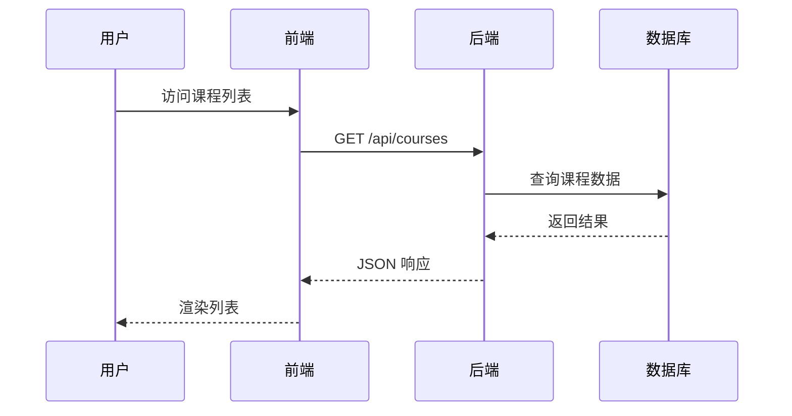
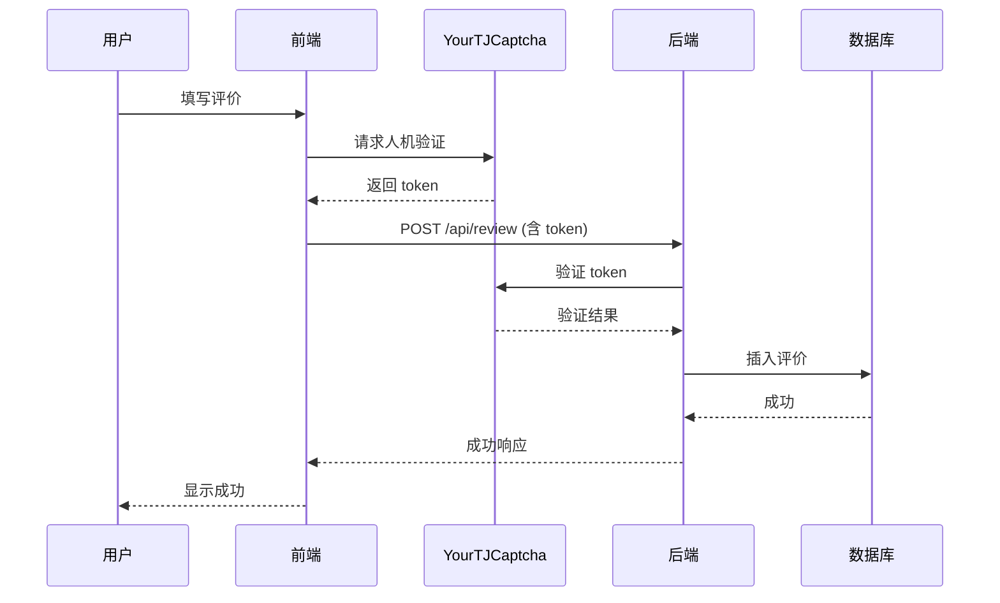

# 开发概述

本章节详细介绍 YourTJ 选课社区的技术实现细节，帮助开发者深入理解项目架构。

## 技术栈总览

### 前端技术

| 技术 | 版本 | 用途 |
|------|------|------|
| React | 18.2.0 | UI 框架 |
| TypeScript | 5.3.0 | 类型安全 |
| Vite | 5.0.0 | 构建工具 |
| React Router | 6.21.0 | 路由管理 |
| Framer Motion | 12.25.0 | 动画效果 |
| Tailwind CSS | CDN | 样式框架（通过 CDN 引入） |

### 后端技术

| 技术 | 用途 |
|------|------|
| Cloudflare Workers | Serverless 运行时 |
| Hono | Web 框架 |
| D1 Database | SQLite 数据库 |
| Sqids | ID 编码 |

### 外部服务

| 服务 | 用途 |
|------|------|
| YourTJCaptcha | 人机验证 |
| Waline | 评论系统 |
| Neon | PostgreSQL 数据库（Waline） |
| Vercel | 服务托管 |

## 项目架构

```
┌─────────────────────────────────────────────────────────────────┐
│                         用户浏览器                               │
└─────────────────────────────────────────────────────────────────┘
                                │
                                ▼
┌─────────────────────────────────────────────────────────────────┐
│                    Cloudflare CDN / Pages                        │
│                      (静态资源托管)                               │
└─────────────────────────────────────────────────────────────────┘
                                │
        ┌───────────────────────┼───────────────────────┐
        ▼                       ▼                       ▼
┌───────────────┐     ┌───────────────┐     ┌───────────────┐
│   React SPA   │     │   Workers     │     │    Waline     │
│   (Frontend)  │────▶│   (Backend)   │     │   (Comments)  │
└───────────────┘     └───────────────┘     └───────────────┘
                              │                     │
                              ▼                     ▼
                      ┌───────────────┐     ┌───────────────┐
                      │  D1 Database  │     │     Neon      │
                      │   (SQLite)    │     │  (PostgreSQL) │
                      └───────────────┘     └───────────────┘
```

## 核心模块

### 前端模块

```
frontend/src/
├── components/          # 可复用组件
│   ├── Navbar.tsx         # 导航栏
│   ├── BottomNavigation.tsx # 移动端底部导航
│   ├── GlassCard.tsx      # 玻璃态卡片
│   ├── FilterPanel.tsx    # 筛选面板
│   ├── MarkdownEditor.tsx # Markdown 编辑器
│   └── TemplateSelector.tsx # 评价模板选择器
│
├── pages/               # 页面组件
│   ├── Courses.tsx        # 课程列表页
│   ├── Course.tsx         # 课程详情页
│   ├── WriteReview.tsx    # 写评价页
│   ├── Admin.tsx          # 管理后台
│   ├── About.tsx          # 关于页面
│   ├── FAQ.tsx            # 常见问题
│   └── Feedback.tsx       # 反馈页面
│
├── services/            # API 服务
│   └── api.ts             # API 调用封装
│
└── App.tsx              # 应用入口
```

### 后端模块

```
backend/src/
├── index.ts             # 主入口，路由定义
└── sqids.ts             # ID 编码工具
```

## 数据流

### 课程列表加载



### 评价提交流程



## 开发规范

### 代码风格

- 使用 TypeScript 严格模式
- 组件使用函数式写法 + Hooks
- 样式使用 Tailwind CSS 工具类
- API 调用统一封装在 services 目录

### 命名规范

| 类型 | 规范 | 示例 |
|------|------|------|
| 组件文件 | PascalCase | `CourseCard.tsx` |
| 工具文件 | camelCase | `api.ts` |
| CSS 类名 | kebab-case | `course-card` |
| 常量 | UPPER_SNAKE_CASE | `API_BASE_URL` |

### Git 提交规范

遵循 Conventional Commits：

```
feat: 新功能
fix: Bug 修复
docs: 文档更新
style: 代码格式
refactor: 重构
perf: 性能优化
test: 测试
chore: 构建/工具
```

## 文档导航

### 架构详解

- [前端架构](/development/frontend) - React 组件设计
- [后端架构](/development/backend) - Workers API 设计
- [数据表结构](/development/database) - D1 数据库设计
- [API 接口](/development/api) - RESTful API 文档

### 核心功能

- [筛选逻辑](/development/filtering) - 课程筛选实现
- [验证系统](/development/verification) - 管理员验证
- [人机验证](/development/captcha) - YourTJCaptcha 集成
- [评论系统](/development/comments) - Waline 集成
- [唯一标识符](/development/sqids) - Sqids ID 编码

### 部署配置

- [环境变量](/development/env-variables) - 配置参考
- [Cloudflare Workers](/development/cloudflare) - Workers 部署
- [Waline 部署](/development/waline) - 评论系统部署
