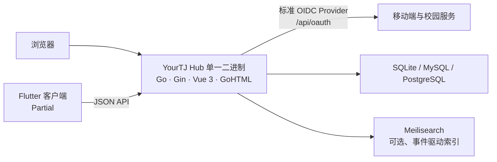

# 开发概述与架构

本文介绍 YourTJ Hub 的系统形态、monorepo 结构、分层与领域边界规则。完整规格见仓库内 `docs/architecture/system-overview.md`。

## 系统形态


```mermaid
flowchart LR
    Browser["浏览器"] --> Hub["YourTJ Hub 单一二进制<br/>Go · Gin · Vue 3 · GoHTML"]
    Mobile["Flutter 客户端<br/>Partial"] -->|JSON API| Hub
    Hub -->|标准 OIDC Provider<br/>/api/oauth| Clients["移动端与校园服务"]
    Hub --> DB["SQLite / MySQL / PostgreSQL"]
    Hub --> Search["Meilisearch<br/>可选、事件驱动索引"]
```

- **单一二进制**：Vue 构建产物（`resource/static/dist`）与 GoHTML 模板通过 `go:embed` 全部嵌入 Go 可执行文件。开发时 Vite（`:3010`）直连后端，生产只有一个文件。无 nginx/CDN 拆分。
- 依赖服务（Meilisearch、PostgreSQL 等）由 Docker Compose 编排；`services/` 只存放部署配置，不携带第三方源码。

## Monorepo 结构

```text
apps/
  gooseforum/       Go + Vue 论坛（核心）
  mobile/           Flutter / Melos 移动端工作区
packages/
  api-contract/     OpenAPI 契约、fixtures 与生成脚本
services/           Meilisearch、积分等服务配置
deploy/             容器、环境与发布脚本
docs/               产品、架构、开发和运维文档
```

## 分层（apps/gooseforum）

| 目录 | 职责 |
|---|---|
| `app/console` | Cobra CLI（`serve` / `mock` / `rebuild-search-index` / `migrate-files` …） |
| `app/bundles` | 工具集（connect / eventbus / jwtopt / i18n / captcha / logging / cache …） |
| `app/models` | GORM 模型 + 迁移（`app/migration`） |
| `app/service` | 业务逻辑（users / topics / mail / oauth / theme …） |
| `app/http/controllers/api` | JSON API（auth / topic / user / admin / chat / notification / file …） |
| `app/http/controllers/forum` | 页面渲染（GoHTML 三模式：payload + render + SEO） |
| `app/http/middleware` | JWT 认证、访问日志、维护模式、限流（每动作，IP+user，429 + Retry-After）… |
| `resource/` | Vue 3 前端（站点 / 管理后台双入口）+ 模板（gohtml）+ 静态资源 |

## 领域边界规则

- 业务逻辑在 `service`，数据访问在 `models` / repository 层，HTTP 在 `http/controllers`；
- 跨域访问（如 论坛→通知）走**属主公开的服务 API**，禁止跨表裸 SQL；
- 前端输出只经由 `resource/static/dist`（go:embed）；对已由 OpenAPI 覆盖的操作，消费生成类型而非手写重复 DTO，未覆盖的接口契约手工维护；
- 上游同步：`git merge` 上游 main，冲突按"我们的改动优先"解决并记录。

## 一致性原则

- 选定的数据库是**业务事实源**；搜索、缓存、计数器、热榜、订阅流都是**可重建投影**；
- 关键副作用（通知、索引同步、积分分发）必须**幂等、可重试、可观测**，不允许无人监督的 fire-and-forget；
- 对已由 OpenAPI 覆盖的操作，契约变更在同一个 PR 内落地：Go 行为 → `openapi.yaml` → 生成 TypeScript → fixture 测试。

## 关键数据流

- **Auth**：Web 走密码（可选论坛侧 TOTP 2FA）/ GitHub OAuth / 内建 OIDC Provider（授权码 + PKCE S256，数值 `sub` = `users.id`）；移动端经 `POST /api/auth/oidc/exchange` 换取论坛 JWT。会话由 `jti` + `user_sessions` 支撑，可逐条撤销。
- **Search**：Meilisearch 可选启用；主题/用户/板块事件驱动索引同步；索引可重建（`rebuild-search-index` CLI）。不可用时整页降级，单索引失败经 `failedScopes` 部分降级。
- **Points**：积分（credit）为 OIDC 客户端 + 独立账本，论坛作为商户调用分发 API（见 `docs/product/credit-and-escrow.md`）。

## 能力状态总表

完整矩阵见[首页能力状态](/guide/introduction#能力状态)与[路线图](/roadmap/)。**正确性优先**基线：

1. 决定内建 OIDC / GitHub OAuth 登录路径的 MFA 策略（论坛 TOTP 复用是 `Decision needed`）；
2. 在大规模 API 重构前扩展 OpenAPI 与生成客户端覆盖，避免未覆盖路由成为新的契约漂移来源。

## 相关文档

- [后端（Go）](/development/backend)
- [前端（Vue 3）](/development/frontend)
- [数据库](/development/database)
- [API 契约](/development/api)
