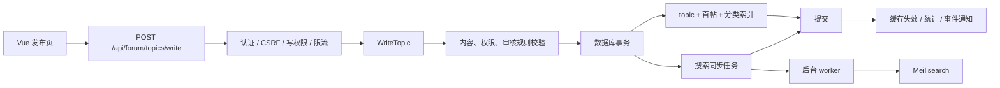

# 架构

YourTJ-Hub 是一个 monorepo。论坛、课程、Wiki、校园服务和移动端共享同一套账号与 API；生产环境中的论坛仍然是一个 Go 可执行文件。

理解仓库时，先跟一条真实请求走一遍，比先记目录更容易。

## 一次发帖会经过什么

以 Web 端发布一个普通话题为例：


```mermaid
flowchart LR
  A["Vue 发布页"] --> B["POST /api/forum/topics/write"]
  B --> C["认证 / CSRF / 写权限 / 限流"]
  C --> D["WriteTopic"]
  D --> E["内容、权限、审核规则校验"]
  E --> F["数据库事务"]
  F --> G["topic + 首帖 + 分类索引"]
  F --> H["搜索同步任务"]
  G --> I["提交"]
  H --> I
  I --> J["缓存失效 / 统计 / 事件通知"]
  H --> K["后台 worker"]
  K --> L["Meilisearch"]
```

这里有两个重要边界。

第一，话题、首帖、分类关系和搜索任务在同一个数据库事务里写入。中间任何一步失败都会回滚，不会留下“有话题但没有首帖”或“数据库成功、搜索任务丢了”的半成品。

第二，事务提交后才处理缓存、通知和搜索投影。数据库是业务事实源；worker 会重新读取已经提交的状态，再决定新增、更新还是删除 Meilisearch 文档。

对应实现可以从 `POST /api/forum/topics/write` 的路由进入，继续看 `WriteTopic` 和 `searchservice.EnqueueTopicSearchTask`。

## 运行时由哪些部分组成

| 部分 | 作用 | 事实源 |
| --- | --- | --- |
| `apps/gooseforum` | Web 页面、JSON API、后台任务、CLI | PostgreSQL / SQLite |
| `apps/mobile` | Flutter 客户端 | 论坛 API |
| `apps/status` | 独立状态站 | Uptime Kuma、Komari、Umami 快照 |
| `packages/api-contract` | OpenAPI 与生成类型 | OpenAPI 3.1 |
| Meilisearch | 主题、用户、课程、Wiki 搜索 | 可重建投影 |
| `YourTongji/YourTJ-Wiki` | Wiki 正文和历史 | GitHub 仓库 |

系统中的数据需要区分业务事实和可重建投影。搜索索引、缓存、统计等可以重建；Wiki 正文以 GitHub 为准，论坛只保存阅读投影。

## 为什么论坛坚持单一二进制

开发时，Vue 由 Vite 在 `3010` 端口运行，Go 后端监听 `5234`。这只是为了热更新。

生产构建时：

1. Vue 输出到 `resource/static/dist`。
2. GoHTML 模板和静态资源由 `go:embed` 打入后端。
3. 最终只部署 `bin/yourtj-hub` 对应的容器进程。

生产环境只保留 Go 论坛进程，反向代理把论坛流量交给该进程。

独立的 `apps/status` 是例外。状态站故意与论坛分开部署，这样论坛数据库或应用进程故障时，状态页仍然有机会工作。

## 后端分层怎么用

| 层 | 负责什么 | 边界 |
| --- | --- | --- |
| `http/controllers` | 解析 HTTP、返回状态码和响应 | 堆复杂业务规则 |
| `service` | 业务规则、事务编排、跨模型操作 | 直接承担页面展示 |
| `models` | GORM 模型和数据访问 | 跨领域写业务逻辑 |
| `migration` | schema 与版本化数据迁移 | 在请求时临时修表 |
| `middleware` | 身份、CSRF、限流、安全头、启动 gate | 偷偷改变业务数据 |
| `console` | serve、migrate、重建索引等 CLI | 复制一套服务逻辑 |

跨领域调用通过对方公开的 service 完成。例如课程逻辑需要更新搜索时，调用搜索域 service；课程代码不直接写 Meilisearch 内部状态。

## 数据一致性怎么处理

YourTJ 当前主要依赖“主事务 + 本地任务表”的方式处理异步副作用。

```text
业务事务
  ├─ 写业务数据
  └─ 写 task_queue
        ↓ commit
后台 worker 领取任务
        ↓
读取最新业务状态
        ↓
更新 Meilisearch / 统计等投影
```

这比“事务提交后直接起一个 goroutine”多了一层记录，但换来三个能力：

- 进程重启后任务仍然存在。
- 重试不会依赖原请求还活着。
- 投影失败不会回滚已经成立的业务事实。

搜索同步是这套模式最典型的例子，详见[搜索](/development/search)。

## 身份边界

YourTJ 的内部身份始终是数值 `users.id`。

不同客户端只是取得会话的方式不同：

- Web：HttpOnly Cookie。
- Flutter：OIDC Authorization Code + PKCE，随后换取论坛 JWT。
- Agent：独立 `agt_` token。
- 学校身份：只作为“我的校园”的私密绑定，不参与论坛用户主键。

详见[身份与 OIDC](/development/identity)。

## 接下来读什么

如果你准备改代码，先完成[本地开发环境](/development/local-development)。

然后按问题进入对应页面：

- HTTP 和业务层：[后端](/development/backend)
- 页面与浏览器状态：[前端](/development/frontend)
- schema / migration：[数据库](/development/database)
- wire contract：[API 契约](/development/api)
- 课程同步和排课：[课程与排课](/development/courses)
