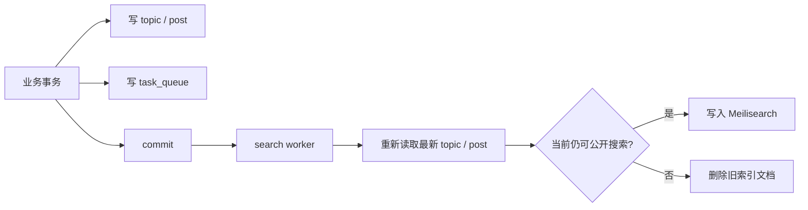

# 搜索

YourTJ 使用 Meilisearch 提供全文搜索。数据库仍是业务事实源，Meilisearch 只保存可以重新生成的投影。

业务写入只依赖数据库提交。Meilisearch 离线时，业务仍可成功，搜索稍后恢复同步。

## 一次索引更新怎么发生

以发布或编辑一个话题为例：



搜索任务和业务数据在同一个事务里入库，所以业务事务回滚时，不会留下一个指向不存在数据的搜索任务。核心实现位于 `apps/gooseforum/app/service/searchservice/indexservice.go`。

任务只携带对象 ID。worker 执行时重新读取当前数据库状态；连续多次编辑会自然收敛到最新投影。

## 为什么通过任务表同步 Meilisearch

如果业务代码先提交数据库，再直接调用 Meilisearch，会出现一个恢复困难的窗口：

```text
数据库提交成功
  ↓
进程崩溃 / Meilisearch 超时
  ↓
数据库是新的，索引还是旧的
```

本地任务表把这个窗口变成可观察、可重试的状态。worker 还有 lease 和 stale-running 恢复逻辑，进程重启后可以继续处理。

## 搜索范围

全局搜索包含：

- 主题。
- 用户。
- 分类。

课程使用独立 `courses` scope。Wiki 也有自己的段落级搜索投影。

用户和分类支持拼音 / 首字母匹配。

::: info
课评正文当前不进入全文索引。课程搜索用于发现课程，不用于搜索评价正文。
:::

## 可见性是二次防线

同步任务可能存在延迟，所以查询阶段不能只相信“索引里有这条记录”。

主题是否能进入公开搜索会再次检查：

- 已发布。
- 未处于待审 / 封禁状态。
- 未软删。
- visibility 正常。

如果主题已经不可见，worker 会删除对应索引文档。聚合搜索也会做防御过滤，降低投影延迟造成的信息泄露风险。

## 部分降级

Meilisearch 整体不可用时，搜索页返回明确的 unavailable 状态。

聚合搜索的某一个 scope 失败时，其他 scope 可以继续返回。响应会记录失败的范围，客户端不需要把一个局部错误显示成“所有搜索都坏了”。

## 配置

本地：

```toml
[meilisearch]
url = "http://localhost:7700"
masterkey = "yourtj-dev-master-key"
maintenance_enabled = true
```

`make dev` 会启动本地 Meilisearch。

多实例共享同一索引时，只让权威实例开启维护能力，避免 main / dev 同时修改同一组索引。

## 重建

因为搜索是投影，仓库保留全量重建路径。

论坛主题索引可以通过 CLI 重建；课程和 Wiki 也各有对应 rebuild / reconcile 逻辑。

修改搜索时，至少验证：

- create。
- update。
- delete / hide。
- restore。
- worker 重试。
- stale lease 恢复。
- 全量 rebuild。
- Meilisearch 不可用时的降级。
