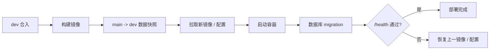

# 部署 YourTJ Hub

YourTJ Hub 的论坛生产形态是 **Go + Vue 单一二进制**。Vue 先构建为静态资源，再通过 `go:embed` 进入 Go 可执行文件。

仓库同时维护 `dev` 和 `main` 两套实例。两套实例共用部署方式，但数据库、配置和 GitHub Environment 分开。

## 部署拓扑

```text
GitHub Actions
  ├─ dev        -> dev instance -> yourtj_dev
  └─ production -> main instance -> yourtj_main

forum container
  ├─ :5234
  ├─ PostgreSQL
  └─ Meilisearch
```

`dev` 不直接连接生产数据库。部署前会从 main 做单向快照，再在 dev 上运行新的 migration。

这里要验证的是生产数据形状能否完成升级。空数据库启动成功无法覆盖这类风险。

## 第一次初始化服务器

仓库提供初始化脚本：

```bash
sudo bash /opt/yourtj/scripts/init-server.sh \
  https://f.yourtj.de https://dev.yourtj.de
```

脚本会准备 `/opt/yourtj`、Compose、PostgreSQL、Meilisearch 和 main / dev 两个数据库，并生成随机 secret。

把脚本输出的敏感值写入对应 GitHub Environment secrets。

::: warning
生产 secret 不要写回仓库。服务器上的 `config.toml` 也不应成为长期手工维护的配置源。
:::

## 配置怎样到服务器

生产配置由 CI 从三类输入渲染：

| 输入 | 负责什么 |
| --- | --- |
| `deploy/config.toml.tmpl` | 配置结构和固定字段 |
| `deploy/instances/<env>.json` | main / dev 的非敏感差异 |
| GitHub Environment secrets | 密钥、DSN、OAuth 凭据等 |

`render_config.py` 会在下发前检查 TOML、必填值和实例数据库。比如 dev 的 DSN 如果误指向 `yourtj_main`，渲染阶段就会拒绝。

配置应用脚本会先保留上一份 `config.toml.prev`，重建容器并做健康检查；失败时恢复上一份配置。

详见[配置参考](/guide/configuration)。

## 一次 dev 发布发生什么

功能 PR 合入 `dev` 后，部署链路大致是：



生产发布走 `dev -> main` 的 release PR，再由 release workflow 创建 tag 并部署 main。

不要手工把一个开发分支镜像直接替换生产实例。

## 启动和 migration

默认 `[db] migration = "on"`。

新进程启动时，HTTP listener 会先绑定，但业务 gate 仍关闭。迁移期间包括 `/health` 在内的请求返回：

```http
503 Service Unavailable
Retry-After: 5
```

schema 和版本化数据 migration 完成后，才启动 worker、cron、OAuth / OIDC、Wiki 同步等业务组件，并打开 gate。

硬迁移失败时进程非零退出，部署脚本会将本次发布判定为失败。

也可以显式执行：

```bash
./yourtj-hub migrate
```

## 回滚

`deploy.sh` 在替换实例前保留上一版镜像引用和配置。

新版本健康检查失败时，会尝试恢复：

1. `config.toml.prev`。
2. 上一份 Compose。
3. 上一镜像 tag。

这并不意味着所有 migration 都可以无条件回滚。删除列、收紧约束等不可逆变化仍需要向前兼容设计和 dev 演练。

## 本地构建

```bash
make build
```

它会先构建 Vue，再生成：

```text
bin/yourtj-hub
```

## 发布后检查

至少确认：

- `/health` 返回 200。
- 首页、登录和公开 API 可访问。
- migration 没有 hard failure。
- Meilisearch 只有正确实例负责维护共享索引。
- Wiki 同步状态正常。
- dev 没有向生产用户发真实 Web / native push。
- config drift 检查通过。

如果改了 OAuth、对象存储、校园连接或推送，再补对应的真实链路验证。
