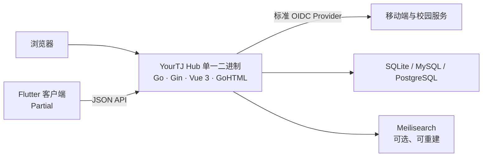

# 项目简介

## YourTJ Hub 是什么

**YourTJ Hub** 是一个面向同济校园的社区平台，以板块化论坛为核心，希望让校园经验、问题与观点不再消失在短暂的信息流中。项目提供搜索、统一身份、内容治理和多端访问能力，并为未来的课程、课评等校园服务保留共享基础设施。

- 线上站点：[https://forum.yourtj.de](https://forum.yourtj.de)
- 源码仓库：[YourTongji/YourTJ-Hub](https://github.com/YourTongji/YourTJ-Hub)
- 默认开发分支：`dev`（PR 目标分支），`main` 为生产分支

## 项目愿景与定位

YourTJ Hub 希望让校园经验、问题与观点沉淀为长期有价值、可检索的信息，而不是淹没在短暂的信息流里。产品目标（详见仓库内 `docs/product/vision-and-principles.md`）：

- 学生使用**一个账号**即可访问论坛与未来的校园服务，无需重复注册；
- 论坛内容有清晰的板块、上下文与可回退的治理流程，不退化为一维短内容流；
- 站内内容统一可搜索（中文友好），信息长期积累而非被时间线冲走；
- 贡献可获得积分并在跨平台结算，但**积分不是可充值货币**（不可充值、不可提现、不可自由转账）；
- 移动端（iOS/Android）与 Web 共享同一套 API 与体验语义。

## 与 GooseForum 的关系

YourTJ Hub 的核心论坛直接演进自 [GooseForum](https://github.com/leancodebox/GooseForum)，保留了 Go 后端、Vue 前端与 GoHTML 模板打包进**同一个可执行文件**的部署方式。这里不是对上游的薄包装：产品、认证、搜索、数据、移动端与运维能力都在本仓库中持续演进，同时保留了可合并上游更新的代码结构（`apps/gooseforum` 保留 GooseForum 的 Go module 名称与主要分层）。

## 能力状态

下表是当前的能力状态，`Current` / `Partial` / `Planned` 是严格的实现状态（完整定义与缺口见仓库内 `docs/product/current-state.md`，本站[路线图](/roadmap/)是它的中文快照）：

| 领域 | 状态 | 当前能力 |
|---|---|---|
| 论坛 | `Current` | 主题与回复、板块、通知、私信、草稿、Markdown、RBAC 管理与多语言界面 |
| 身份与安全 | `Partial` | 密码、GitHub OAuth、论坛内建 OIDC Provider、TOTP 2FA、可撤销会话；移动端与外部服务可使用标准授权码 + PKCE 登录 |
| 搜索 | `Partial` | Meilisearch 聚合搜索、拼音匹配与事件驱动索引；搜索服务为可选依赖 |
| 数据与文件 | `Current` | SQLite 默认，支持 MySQL / PostgreSQL 主库；文件可存于 SQLite BLOB 或 S3 兼容对象存储 |
| 内容治理 | `Current` | 敏感词审核、限流与验证码、审计、服务条款、数据导入导出 |
| 移动端 | `Partial` | Flutter 客户端、共享设计语言与 OIDC 登录已实现，尚未发布到应用商店 |
| API 契约 | `Partial` | OpenAPI 校验、TypeScript 生成与契约测试已落地，尚未覆盖全部接口 |
| 积分（论坛内记账） | `Current` | 主题/回复奖励在论坛内幂等记账、回复删除原子回滚 |
| 积分（跨平台结算） | `Planned` | `services/credit` 跨平台结算尚未上线；不可充值、不可提现、不可自由转账 |

## 架构概览



项目遵循四个重要约束：

- **单一二进制**：Vue 构建产物与 GoHTML 模板通过 `go:embed` 进入 Go 可执行文件，生产环境不拆分前后端；
- **数据库是真相源**：搜索索引、缓存和计数都是可重建投影，不承载唯一业务事实；
- **身份可互操作**：论坛 `users` 表是身份真相源，内建 OIDC Provider 对外签发数值型 `sub`；
- **上游可同步**：`apps/gooseforum` 保留 GooseForum 的 Go module 名称与主要分层，便于持续合并上游更新。

## 技术栈

| 范围 | 技术 |
|---|---|
| 后端 | Go 1.26、Gin、GORM、Cobra |
| Web | Vue 3、TypeScript、Vite、Tailwind CSS、GoHTML |
| Mobile | Flutter、Dart、Melos、Riverpod |
| 数据 | SQLite、MySQL、PostgreSQL、Meilisearch |
| 身份 | 内建 OIDC Provider、GitHub OAuth、JWT、TOTP |
| 交付 | `go:embed` 单一二进制、Docker Compose、GitHub Actions |

## 仓库结构

```text
apps/
  gooseforum/       Go + Vue 论坛，前端最终嵌入后端二进制
  mobile/           Flutter / Melos 移动端工作区
packages/
  api-contract/     OpenAPI、fixtures 与生成脚本
services/           Meilisearch、归档 Casdoor 配置、积分等服务配置
deploy/             容器、环境与发布脚本
docs/               产品、架构、开发和运维文档（英文规格，本站中文指南是对它的解读）
```

## 快速链接

- 进入站点：[https://forum.yourtj.de](https://forum.yourtj.de)
- GitHub 仓库：[https://github.com/YourTongji/YourTJ-Hub](https://github.com/YourTongji/YourTJ-Hub)
- 仓库文档入口：[docs/README.md](https://github.com/YourTongji/YourTJ-Hub/blob/dev/docs/README.md)
- 快速开始：[快速开始](/guide/getting-started)
- 反馈问题 / 功能建议：[Issues](https://github.com/YourTongji/YourTJ-Hub/issues)
