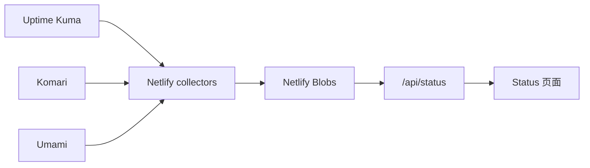

# 运行状态站

`apps/status` 是独立于论坛部署的 Vue / Vite 应用，目标地址为 `status.yourtj.de`。

状态站用于在论坛故障时继续提供服务状态。它不读取论坛 Cookie，也不调用论坛 API。

## 数据从哪里来

| 来源 | 展示内容 |
| --- | --- |
| Uptime Kuma | 可用性、检测结果、响应时间 |
| Komari | CPU、内存、磁盘、网络、运行时长 |
| Umami | 访客、浏览量、访问次数等公开统计 |

浏览器不会直接访问这些上游。

Netlify Functions 负责采集允许公开的字段，把结果写入 Netlify Blobs；页面只读取 `/api/status` 返回的快照。



上游 URL、共享 token 和原始响应不会交给浏览器。

## 为什么使用快照

如果每个访客打开页面都直接请求三套上游，状态页会把用户流量放大成监控流量，而且某个上游变慢时会拖慢整页。

当前采集分两类：

- 当前状态和资源：每分钟。
- 历史曲线和访问统计：每五分钟。

浏览器定期读取已经生成的快照，不触发新的上游采集。

## 过期数据怎么显示

状态站保留原始采集时间，不会因为浏览器刚刷新页面就把旧数据变成“实时”。

当前资源 / 可用性超过约 150 秒会视为过期；历史和流量使用更长的过期窗口。单个来源失败时，最近成功数据可以短暂保留，但会明确显示为过期。

页面会把缺少新数据标记为过期，不会显示成“服务正常”。

## 部署到 Netlify

在 Netlify 导入 `YourTongji/YourTJ-Hub` 后使用：

| 项目 | 值 |
| --- | --- |
| Production branch | `main` |
| Base directory | `apps/status` |
| Build command | `pnpm build` |
| Publish directory | `dist` |
| Functions directory | `netlify/functions` |
| Node.js | `24` |

配置公开来源环境变量后，先手动运行 `collect-current` 和 `collect-history`，再检查 `/api/status`。

定时函数只在 published deploy 自动运行。Deploy Preview 和本地环境需要手动触发采集。

## 本地验证

```bash
cd apps/status
pnpm install --frozen-lockfile
pnpm test
pnpm build
pnpm test:browser
```

本地构建通过只说明应用本身可运行。上线还要检查 Netlify Functions、Blobs、DNS、HTTPS 和定时采集是否真正工作。
